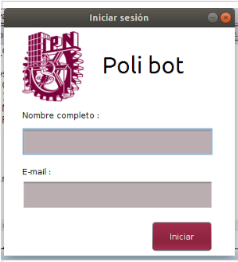
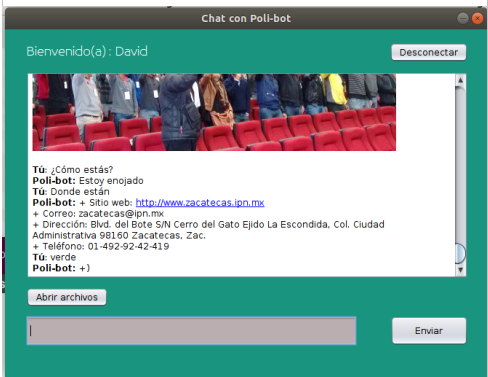

# Poli-bot

Chatbot que responde usando un algoritmo de programación dinámica (edit distance), permitiendo así ubicar un intent* y seleccionar de forma pseudoaleatoria alguna
las posibles respuestas.

* Intent: El sistema lo primero que trata de identificar cuando alguien le escribe es la “intención” de lo que el usuario le ha querido decir. 
Por ejemplo, si estamos delante de un chatbot para reservar entradas, habremos definido diferentes intenciones propias del negocio 
como #ComprarEntrada, #ModificarReserva, #DevoluciónEntrada.

Para probar su funcionamiento es necesario correr primero [Servidor.java](https://github.com/dbetm/poli-bot/blob/master/src/polibot_servidor/Servidor.java) y luego [Cliente_login.java](https://github.com/dbetm/poli-bot/blob/master/src/polibot_cliente/Cliente_login.java).

## ¿Qué puede hacer o qué funcionalidad tiene?
1. El agente puede emitir respuestas en forma de texto, hipervínculos y archivos (pdf, jpg y png).
2. Varios usuarios pueden estar conversando con el agente conversacional al mismo tiempo.
3. El agente contempla los siguientes intents: Despedida, Saludo, Ingeniería en alimentos, Ingeniería ambiental, Ingeniería en sistemas computacionales, 
Ingeniería mecatrónica, Ingeniería metalúrgica, Becas, Contacto, Convertidor de temperaturas, Conócenos, Sobre los creadores, Derivadas, Integrales, Director, 
Egresados, Logo, Fotos, Agradecimiento, Huélum, Misión, Visión, Nombre, Oferta educativa, Recursos educativos, Tabla periódica, Sitio web, Club de programación, 
Sentimientos, Default intent.
4. Inicio de sesion con correo electrónico y nombre completo.
5. El servidor escribe en un archivo de log los usuarios (nombre completo y correo) que se han conectado y la hora. Para loggin del servidor, 
mantiene el formato separado por comas para abrirlo en hojas de cálculo.
6. El usuario tiene la opción desconectarse cuando quiera.
7. El usuario no puede recuperar mensajes de una sesión pasada, esto es porque el sistema no persisten las conversaciones.
8. Hay una pequeña alerta sonora que se escucha cuando el usuario recibe un mensaje del agente conversacional.

### Capturas del cliente del sistema funcionando

